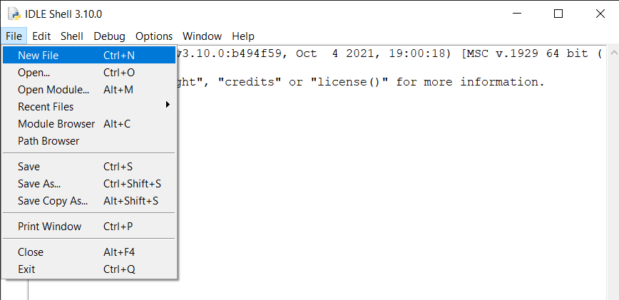
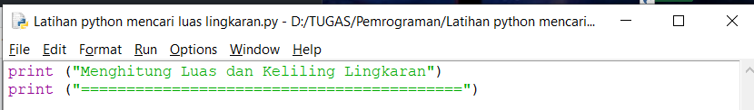
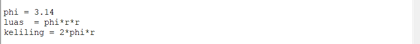
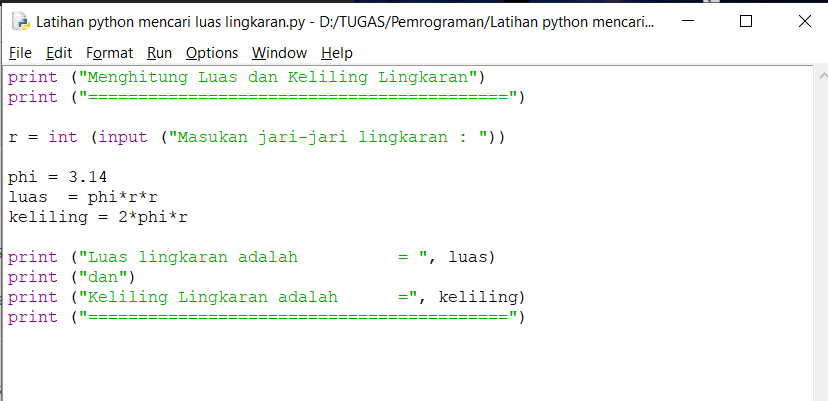
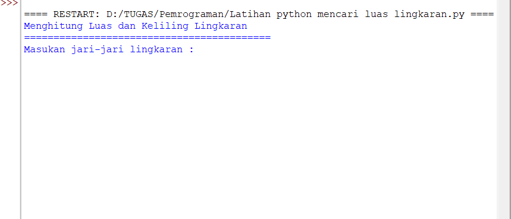
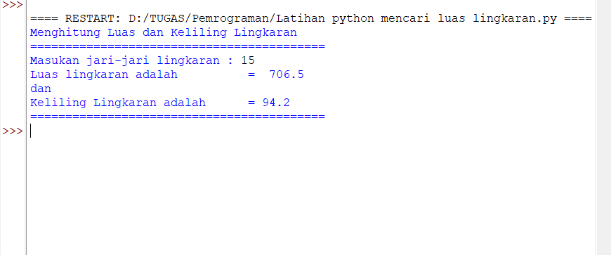

# Praktikum-2
# Mencari Luas dan Keliling Lingkaran beserta Flow Chart 

1. Pertama kita cari tahu rumus Luas dan keliling lingkaran. untuk rumus luas yaitu (L = phi * r * r) sedangkan rumus keliling yaitu (Kel = 2 * phi * r). setelah mengetahui rumusnya, kita lanjut untuk pembuatan program.
2. Kita buka dulu aplikasi python nya. lalu pilih new file.

3. langkah pertama kita buat dulu header / judul program. seperti gambar berikut.

4. Setelah itu kita buat perintah untuk input jari-jari lingkaran, seperti gambar berikut .

5. Lalu ketikan nilai phi dan rumus Luas Keliling lingkaran yang sudah kita ketahui tadi.seperti gambar berikut.

6. Selanjutnya ketikan perintah untuk menampilkan luas dan keliling lingkaran. 
seperti gambar berikut.

7. Program telah selesai. selanj
utnya kita jalankan programnya dengan cara klik F5/Fn+F5.

8. Berikut adalah tampilan program. 

9. Disini kita disuruh memasukan nilai jari-jari lingkaran, kita coba masukan jari-jari = 15. maka program akan otomatis mencari Luas dan keliling lingkarannya. Berikut gambarnya.

10. Program Python untuk mencari luas dan keliling lingkaran telah selesai. semoga tutorial ini bermanfaat untuk teman-teman. Terima Kasih Selamat Belajar.