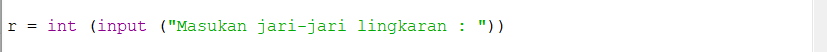
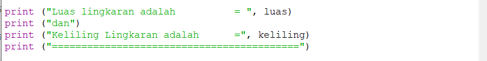
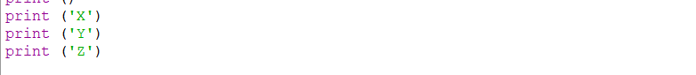
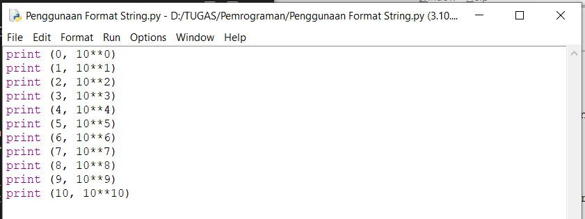

# Praktikum-2
# Mencari Luas dan Keliling Lingkaran beserta Flow Chart 

1. Pertama kita cari tahu rumus Luas dan keliling lingkaran. untuk rumus luas yaitu (L = phi * r * r) sedangkan rumus keliling yaitu (Kel = 2 * phi * r). setelah mengetahui rumusnya, kita lanjut untuk pembuatan program.
2. Kita buka dulu aplikasi python nya. lalu pilih new file.

3. langkah pertama kita buat dulu header / judul program. seperti gambar berikut.

4. Setelah itu kita buat perintah untuk input jari-jari lingkaran, seperti gambar berikut .

5. Lalu ketikan nilai phi dan rumus Luas Keliling lingkaran yang sudah kita ketahui tadi.seperti gambar berikut.

6. Selanjutnya ketikan perintah untuk menampilkan luas dan keliling lingkaran. 
seperti gambar berikut.

7. Program telah selesai. selanj
utnya kita jalankan programnya dengan cara klik F5/Fn+F5.

8. Berikut adalah tampilan program. 

9. Disini kita disuruh memasukan nilai jari-jari lingkaran, kita coba masukan jari-jari = 15. maka program akan otomatis mencari Luas dan keliling lingkarannya. Berikut gambarnya.

10. Program Python untuk mencari luas dan keliling lingkaran telah selesai. semoga tutorial ini bermanfaat untuk teman-teman. Terima Kasih Selamat Belajar.
 Berikut adalah FLOWCHART dari mencari Luas dan Keliling Lingkaran.

 
# Latihan/Lab 1
# Penjelasan mengenai Penggunaan END 
 
 1. perintah end ini berfungsi untuk mengubah karakter baris bawaan python dengan karakter lain sesuai keinginan kita. seperti pada gambar berikut :

  
 

 2. berbeda jika tidak ada perintah end. maka variable akan berurutan ke bawah sesuai bawaan dari python. seperti gambar berikut :

Berikut adalah contoh program secara keseluruhannya. 

 # Penjelasan penggunaan separator

 1. Separator berfungsi untuk mengganti pemisah spasi menjadi karakter apapun yang kita inginkan. seperti contoh gambar berikut :

 # Penjelasan Penggunaan Format String
 
 1. String merupakan type data untuk menampilkan karakter huruf dan angka.
 2. Ini adalah contoh program bilangan berpangkat, disini kita memasukan angka 10 yang dipangkatkan dari pangkat 0-10. berikut contoh programnya

 
 Ada contoh lagi untuk format string, berikut contoh programnya :
 

 Contohnya sama seperti yang sebelumnya. tapi perbedaannya hanya terdapat pada tata letaknya saja menjadi terbalik. Seperti gambar ini

 # Lab 2
 # Menghitung Penjumlahan dan Pembagian Variable (a,b)

 1. Ketikan perintah untuk memasukan nilai a,b dan perintah untuk mencari hasil dari penggabungan variable a,b. Seperti Gambar berikut :

 2. Selanjutnya ketikan type data integer untuk menghitung bilangan bulat. Dan juga ketik perintah untuk menampilkan hasil penjumlahan dan pembagian variable a,b. Seperti gambar berikut .

 3. Ini adalah hasil dari program tersebut. disini kita masukan variabel a(10) dan b(5). maka hasil jumlah dan baginya adalah seperti gambar berikut :

